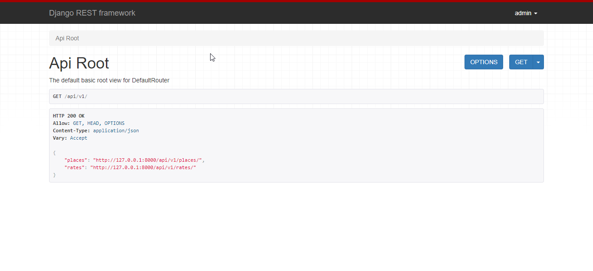
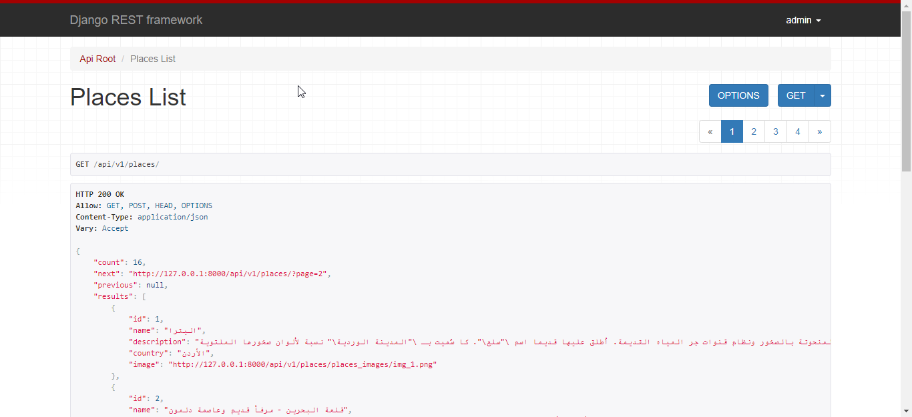
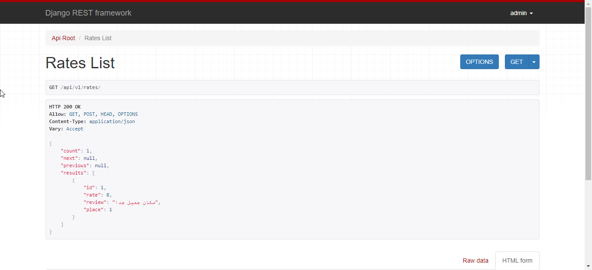
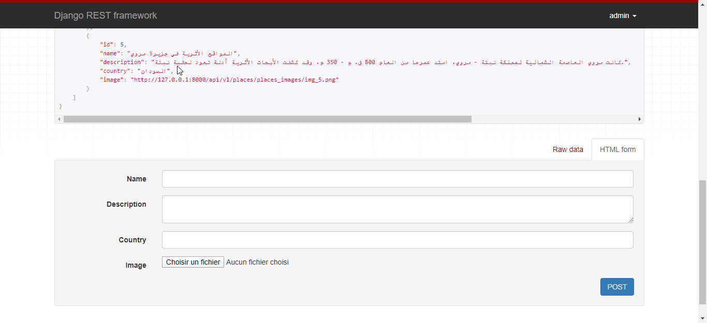
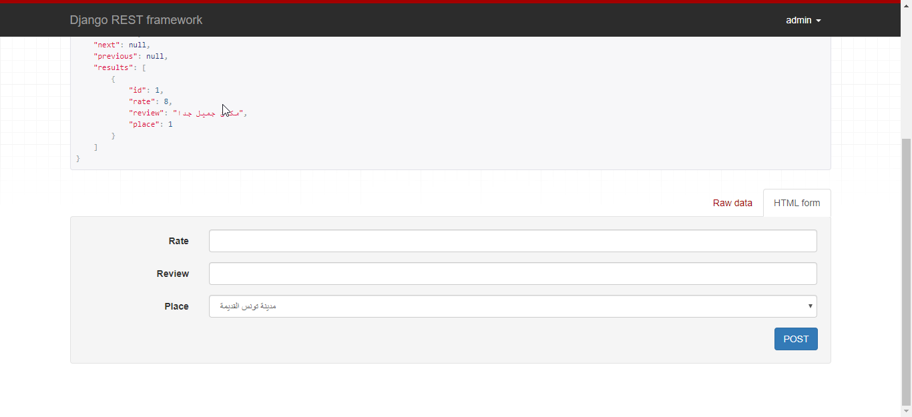

# historicalplaces
This is the second project from [Web Development with Django](https://app.barmej.com/%D8%A8%D8%B1%D9%85%D8%AC%D8%A9-%D8%A7%D9%84%D9%85%D9%88%D8%A7%D9%82%D8%B9-%D9%85%D8%B9-%D8%AC%D8%A7%D9%86%D8%BA%D9%88-Django) course, it is basically
Restfull API ready to use made using Django for arabic historical places <br><br>


## Tools & Languages
- HTML5
- CSS3
- [django-rest-framework](https://www.django-rest-framework.org/)
- Django
- VSCode

## Features
- Django authentication system (login, logout)
- Throtteling requests for authenticated & non-authenticated  users
- Permissions for authenticated & non-authenticated  users
- Token Authentication
- Non-authenticated  users can't add new places but they can add new ratings


## Screenshots
<h4 align="center">Endpoints</h4>
<p align="center"></p>
<table>
    <tr>
      <th>places</th>
      <th>rates</th>
    </tr>
    <tr>
      <td></td>
      <td></td>
    </tr>
    <tr>
      <th>add new place</th>
      <th>add new rate</th>
    </tr>
    <tr>
      <td></td>
      <td></td>
    </tr>
</table>


## Usage

The project structure should look like this
```
├── .git
├── historicalplaces # main folder
│   ├── │   └── ... # This is the main project folders
│   ├── │  requirements.txt
├── historical_places_env # virtual environment
│   ├── │   └── ...
└── README.md
```
Admin user account <br>
> _**username:**_ admin <br>
> _**password:**_ admin123

```bash
// 1- Create a virtual environment
~ virtualenv historical_places_env
// 2- Activate the virtual environment
(Mac)
~  source historical_places_env/bin/activate
(Windows)
~  cd historical_places_env/Scripts
~  activate
~  cd ../..
// 3- Change directory to the project folder
~ cd historicalplaces
// 4- Install dependecies from requirements.txt file
~ pip install -r requirements.txt
// 5- Check if all dependencies were installed successfully
~ pip freeze
// 6- Open historicalplaces folder with pycharm & select virtual environment python interpreter
// 7- Run server
~ python manage.py runserver

```

## Contributing
Pull request are welcome feel free to ```fork``` this repo.

## License
This project is open-sourced under the [MIT](https://opensource.org/licenses/MIT) license.

